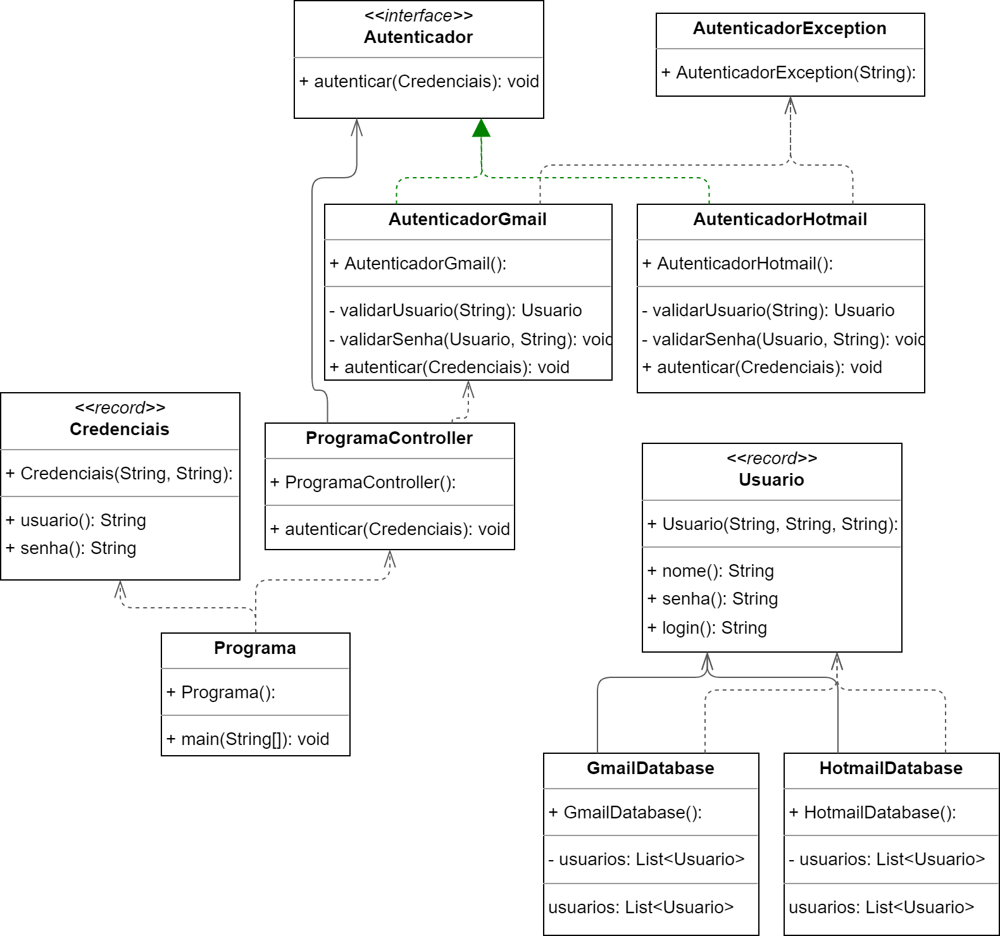

# Padrão de projeto GRASP.

3 padrões GRASP escolhidos para serem utilizados na implementação de um algorítmo autenticador de login de usuários.

* Controller.
* Baixo acoplamento.
* Alta coesão.
* Polimorfismo.
* Information expert.



## Classes records para armazenamento de informação.

### Aplicação do padrão info expert:

```java
public record Credenciais(String usuario, String senha) {
}

public record Usuario(String nome, String login, String senha) {
}
```

## AutenticadorException para ser lançada ao ocorrer um erro no processo de autenticação.

```java
public class AutenticadorException extends RuntimeException {

    @Serial
    private static final long serialVersionUID = 1L;

    public AutenticadorException(String mensagem) {
        super(mensagem);
    }

}
```

## Interface Autenticator e suas implementações.

### Aplicação do padrão polimorfismo:

```java
public interface Autenticador {
    void autenticar(Credenciais credenciais);
}
```

```java
public class AutenticadorGmail implements Autenticador {

    @Override
    public void autenticar(Credenciais credenciais) {
        /**
         * 1. Validar se o login possui @gmail, senão possuir lançar AutenticadorException 
         * 2. Validar se composição da senha está correta, senão estiver, lançar AutenticadorException 
         * 3. Validar se login existe no sistema, senão, lançar AutenticadorException 
         * 4. Validar se a senha passada é igual a senha armazenada, senão, lançar AutenticadorException
         */
        Usuario usuarioEncontrado = validarUsuario(credenciais.usuario());
        validarSenha(usuarioEncontrado, credenciais.senha());

    }

    private Usuario validarUsuario(String login) {
        if (!login.contains("@gmail"))
            throw new AutenticadorException("Usuário ou senha inválidos");

        List<Usuario> usuarios = GmailDatabase.getUsuarios();
        return usuarios.stream().filter(usuario -> usuario.login().equals(login)).findFirst()
                .orElseThrow(() -> new AutenticadorException("Usuário ou senha inválidos"));
    }

    private void validarSenha(Usuario usuario, String senha) {
        if (senha.length() < 8)
            throw new AutenticadorException("Usuário ou senha inválidos");

        if (!usuario.senha().equals(senha)) {
            throw new AutenticadorException("Usuário ou senha inválidos");
        }
    }
}
```

```java
public class AutenticadorHotmail implements Autenticador {

    @Override
    public void autenticar(Credenciais credenciais) {
        /**
         * 1. Validar se o login possui @hotmail, senão possuir lançar AutenticadorException 
         * 2. Validar se composição da senha está correta, senão estiver, lançar AutenticadorException 
         * 3. Validar se login existe no sistema, senão, lançar AutenticadorException 
         * 4. Validar se a senha passada é igual a senha armazenada, senão, lançar AutenticadorException
         */
        Usuario usuarioEncontrado = validarUsuario(credenciais.usuario());
        validarSenha(usuarioEncontrado, credenciais.senha());
    }

    private Usuario validarUsuario(String login) {
        if (!login.contains("@hotmail"))
            throw new AutenticadorException("Usuário ou senha inválidos");

        List<Usuario> usuarios = HotmailDatabase.getUsuarios();
        return usuarios.stream().filter(usuario -> usuario.login().equals(login)).findFirst()
                .orElseThrow(() -> new AutenticadorException("Usuário ou senha inválidos"));
    }

    private void validarSenha(Usuario usuario, String senha) {
        if (senha.length() < 8)
            throw new AutenticadorException("Usuário ou senha inválidos");

        if (!usuario.senha().equals(senha)) {
            throw new AutenticadorException("Usuário ou senha inválidos");
        }
    }
}
```

## Bancos de dados mocados.

```java
public class HotmailDatabase {

    private static List<Usuario> usuarios = new ArrayList<>();

    static {
        usuarios.add(new Usuario("Gabriel", "gabriel@hotmail.com", "123456789"));
    }

    public static List<Usuario> getUsuarios() {
        return usuarios;
    }
}

public class GmailDatabase {

    private static List<Usuario> usuarios = new ArrayList<>();

    static {
        usuarios.add(new Usuario("Edson", "edson@gmail.com", "12345678"));
    }

    public static List<Usuario> getUsuarios() {
        return usuarios;
    }
}
```

## Ponto de início da execução do programa.

### Aplicação do padrão controller:

```java
public class ProgramaController {
    Autenticador autenticador = new AutenticadorGmail();

    public void autenticar(Credenciais credenciais) {
        autenticador.autenticar(credenciais);
    }
}

public class Programa {
    public static void main(String[] args) {
        ProgramaController controller = new ProgramaController();

        Scanner input = new Scanner(System.in);

        System.out.println("Login: ");
        String usuario = input.next();

        System.out.println("Senha: ");
        String senha = input.next();

        controller.autenticar(new Credenciais(usuario, senha));

        input.close();
    }
}
```